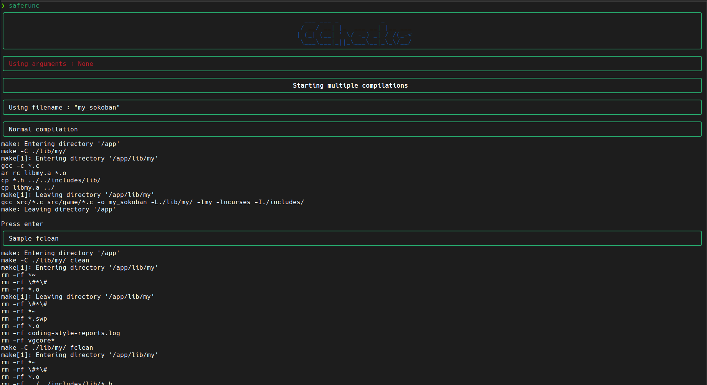

# Epitech C Code Checker

---

## See how bad u code !

---

This tool provide a simple yet powerfull way to check a lot of informations about your current Epitech project.

Added to your bashrc, this one command will give you a complete overview of your project, where it works, and where it does not, if it complies good, if you use some unauthorised syscalls...

---

### How to install

To install this tool, please :

- Install docker (for the GOATs using Ubuntu, I have an install script [here](https://github.com/Tech0ne/install-docker))
- Run the following `sudo docker build -t saferunc:latest .` to build the image
- [Optional] Add the alias to your bashrc, fishrc, zshrc... (find the alias in [this file](alias.bashrc))

---

### How to use

To use, simply run the command "saferunc" in a school repo (or the looong command if you did not add the alias)

This will give you a full overview of your project